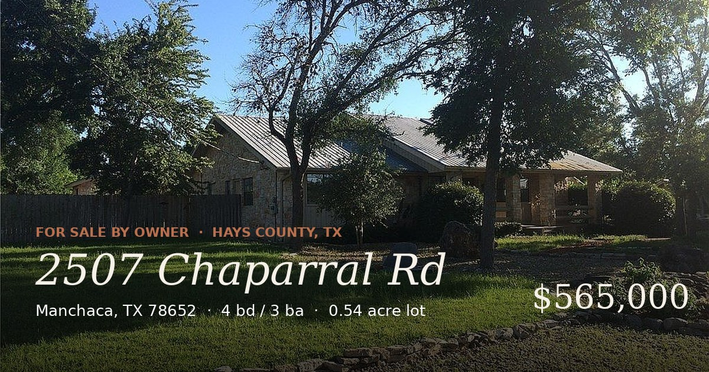

# 2507 Chaparral Rd · Manchaca, TX 78652

A single-page listing site + downloadable PDF brochure for a for-sale-by-owner home in Hays County, Texas.



**Live site:** https://YOUR-USERNAME.github.io/YOUR-REPO/
**PDF brochure:** [2507-chaparral-rd.pdf](./2507-chaparral-rd.pdf)

---

## The home, at a glance

| | |
|---|---|
| **Address** | 2507 Chaparral Rd, Manchaca, TX 78652 |
| **Asking** | $565,000 ($202/sq ft) |
| **Beds / Baths** | 4 / 3 (2 full + 1 half) |
| **Living area** | 2,097 sq ft |
| **Total improvements** | 2,797 sq ft (incl. detached garage, carport, storage) |
| **Lot** | 0.54 acres |
| **Year built** | 1978 |
| **Parking** | 8 spaces (attached + detached garage + carport + drive) |
| **Roof** | Metal |
| **Schools** | Hays CISD — Carpenter Hill / Eric Dahlstrom / Moe & Gene Johnson |
| **Parcel ID** | R23644 (Hays CAD) |

---

## Repository contents

```
.
├── index.html                  # The listing page (GitHub Pages entry point)
├── 2507-chaparral-rd.pdf       # 4-page printable brochure
├── preview.jpg                 # 1200×630 OpenGraph/social preview image
├── images/                     # Property photos referenced by index.html
│   ├── photo1.jpg
│   ├── photo2.jpg
│   ├── photo3.jpg
│   ├── photo4.jpg
│   └── photo5.jpg
├── 404.html                    # Custom 404 page
├── README.md
├── LICENSE
└── .gitignore
```

No build step. No framework. Pure HTML + CSS, fonts loaded from Google Fonts CDN.

---

## Deploy to GitHub Pages

```bash
# 1. Create the repo on github.com first, then:
git init
git add .
git commit -m "Initial listing"
git branch -M main
git remote add origin https://github.com/YOUR-USERNAME/YOUR-REPO.git
git push -u origin main
```

Then in the repository on github.com:

1. **Settings → Pages**
2. **Source:** Deploy from a branch
3. **Branch:** `main` / `/ (root)` → **Save**

The site goes live at `https://YOUR-USERNAME.github.io/YOUR-REPO/` within a minute or two.

### Optional: custom domain

Add a `CNAME` file containing your domain (e.g. `2507chaparral.com`), point a DNS A record at GitHub Pages' IPs (`185.199.108.153`, `185.199.109.153`, `185.199.110.153`, `185.199.111.153`), and toggle **Enforce HTTPS** in the Pages settings once the cert provisions.

---

## Before you publish — three edits

**1. Update OpenGraph URLs** in `index.html` (lines starting with `<meta property="og:` and `<meta name="twitter:image"`). Replace `YOUR-USERNAME` and `YOUR-REPO` so social previews work on Facebook, X, LinkedIn, iMessage, etc.

**2. Update the contact link.** Search `index.html` for `owner@example.com` and replace with your real email (or swap the button for a phone link: `href="tel:+15125551234"`).

**3. Optionally adjust price.** Search `index.html` for `$565,000` — there are three instances (hero badge, AVM table, CTA section). The PDF also embeds the price; if you change it, the brochure should be re-rendered (see "Regenerating the PDF" below).

---

## Customizing further

- **Photos:** drop replacements into `images/` keeping the filenames (`photo1.jpg` through `photo5.jpg`). `photo1.jpg` is the hero shot.
- **Color palette:** all colors live in CSS variables at the top of `index.html` (`--cream`, `--ink`, `--sage`, `--clay`, etc).
- **Typography:** Cormorant Garamond for display, Manrope for body. Swap via the Google Fonts `<link>` and the CSS.
- **Sections:** each section is independently styled — delete or reorder freely.

---

## Regenerating the PDF

The PDF was rendered from a separate print-optimized HTML using Playwright. The source isn't checked in here (only the rendered PDF is needed for the site), but if you want to regenerate it after a price/text change, the rough recipe is:

```bash
pip install playwright pillow
python -m playwright install chromium
# then run a small script that loads the print-HTML and calls page.pdf()
# with format='Letter', print_background=True, prefer_css_page_size=True
```

---

## Disclaimer

Information deemed reliable but not guaranteed. Listing is by owner — no real estate agent represents the seller. Buyers are responsible for their own due diligence, including independent inspection and verification of square footage, lot dimensions, school zoning, and any restrictions or easements of record.

---

## License

The page template (HTML/CSS structure) is released under the [MIT License](./LICENSE) — feel free to adapt it for your own FSBO listing.

The property content (photos, address, listing details) is the property of the homeowner and is published here for the purpose of marketing this specific home. Please don't lift the photos or descriptive copy for unrelated use.
